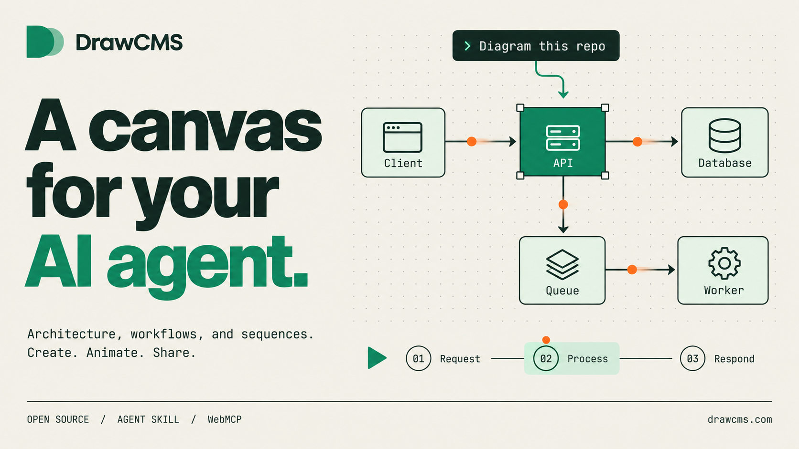

<p align="center">
  <a href="https://drawcms.com"></a>
</p>

<h3 align="center">Diagrams that explain how a system moves, not just how it is wired.</h3>

<p align="center">Describe a flow to your AI agent, or draw it yourself. DrawCMS turns it into an animated technical diagram you can narrate step by step, export as a GIF, and keep as a portable file. Local-first, no account required.</p>

<p align="center">
  <a href="https://drawcms.com/docs"><strong>Documentation</strong></a> &nbsp;·&nbsp;
  <a href="#install-then-describe-your-diagram"><strong>Get started</strong></a> &nbsp;·&nbsp;
  <a href="#build-diagrams-with-an-ai-agent-webmcp"><strong>Agent tools</strong></a> &nbsp;·&nbsp;
  <a href="https://drawcms.com/blog"><strong>Blog</strong></a> &nbsp;·&nbsp;
  <a href="#license"><strong>License</strong></a>
</p>

<p align="center">
  <a href="https://github.com/drawcms/drawcms/stargazers"></a>
  <a href="LICENSE"></a>
  <a href="docs/agent-skill.md"></a>
  <a href="docs/webmcp.md"></a>
</p>

<p align="center">
  <a href="https://drawcms.com"></a>
  <a href="https://drawcms.com/docs"></a>
  <a href="https://drawcms.com/blog"></a>
</p>

## See DrawCMS in action

<p align="center">
  
  <br/>
  <sub><strong>The agent drives the editor.</strong> No API keys, no screenshots, no simulated clicks — it calls the editor's own tools.</sub>
</p>

<p align="center">
  
  <br/>
  <sub><strong>The result.</strong> A sequence diagram with connector motion and a narrated step order</sub>
</p>

### Install, then describe your diagram

Works with Claude Code, Codex CLI, Cursor, and OpenCode.

```bash
npx skills add drawcms/drawcms-skill -g
```

Send this to your agent:

```text
Use DrawCMS to diagram a checkout request: the browser hits the API gateway,
the gateway publishes to a queue, a worker writes to Postgres, and the
response flows back. Animate the request path and narrate it in three steps.
```

Then keep going — “add a Redis cache”, “highlight the failure path”, or “make the queue pulse slower”.

**No repository required.** Start from a description, or point the agent at a repository for a source-backed architecture diagram.

## Show what matters

| Build the structure                                                                                                | Explain the movement                                                                                         | Narrate the story                                                                                     |
| ------------------------------------------------------------------------------------------------------------------ | ------------------------------------------------------------------------------------------------------------ | ----------------------------------------------------------------------------------------------------- |
| 75 palette elements across 17 diagram types — architecture, sequence, UML, ER, BPMN, data flow, network, and more. | Attach motion presets to nodes and connectors independently, so the diagram shows how data actually travels. | Turn a static picture into an ordered walkthrough: each step highlights its own nodes and connectors. |
| [Core concepts ↗](https://drawcms.com/docs/core-concepts)                                                          | [Motion presets ↗](https://drawcms.com/docs/core-concepts)                                                   | [Presentation steps ↗](https://drawcms.com/docs/core-concepts)                                        |

Every diagram is one portable `.drawcms` file. Export it as PNG or an animated GIF, or hand the file to someone else and they get the motion and the narration with it.

## Run it yourself

The editor engine and the web application are a single Next.js project. Clone it, install it, run it — that is the entire setup.

```bash
git clone https://github.com/drawcms/drawcms.git drawcms
cd drawcms
npm install
npm run dev
```

Open <http://localhost:3002>. The app _is_ the editor and redirects there from every route.

<p align="center">
  <a href="https://vercel.com/new/clone?repository-url=https%3A%2F%2Fgithub.com%2Fdrawcms%2Fdrawcms"></a>
  <a href="https://app.netlify.com/start/deploy?repository=https://github.com/drawcms/drawcms"></a>
  <a href="https://render.com/deploy?repo=https://github.com/drawcms/drawcms"></a>
  <a href="https://deploy.workers.cloudflare.com/?url=https://github.com/drawcms/drawcms"></a>
</p>

## Choose the right diagram

<details>
<summary>17 diagram types, their element sets, and the templates that ship with them</summary>

Picking a diagram type in the elements panel narrows the palette to the elements that notation actually uses, so a sequence diagram offers lifelines and activations rather than BPMN gateways.

| Type                    | Best for                                                                    |
| ----------------------- | --------------------------------------------------------------------------- |
| **System Architecture** | Services, storage, boundaries, and the path a request takes through them    |
| **Sequence Diagram**    | Ordered interactions over time — calls, returns, async messages, self-calls |
| **Flowchart**           | Decisions, branches, and terminal outcomes                                  |
| **Data Flow Diagram**   | Sources, transforms, stores, and the sensitivity boundaries between them    |
| **State Diagram**       | States, events, retries, and terminal conditions                            |
| **Activity Diagram**    | Parallel work, forks, joins, and synchronization                            |
| **Class Diagram**       | Types, attributes, operations, and their relationships                      |
| **ERD**                 | Entities, keys, and cardinality                                             |
| **Deployment Diagram**  | Hosts, nodes, and what runs inside each one                                 |
| **Component Diagram**   | Modules, interfaces, and dependencies                                       |
| **Use Case Diagram**    | Actors, goals, and system scope                                             |
| **Network Diagram**     | Routers, switches, servers, and topology                                    |
| **CI/CD Pipeline**      | Build, test, and deploy stages with gates                                   |
| **Timeline Diagram**    | Milestones along an axis                                                    |
| **Org Chart**           | Roles and reporting lines                                                   |
| **Mind Map**            | A central topic and its branches                                            |
| **User Flow Diagram**   | Screens, choices, and the routes between them                               |

Eighteen templates open with motion presets and presentation steps already applied, so a new document is animated before you touch it:

Architecture request flow · Deployment pipeline · Incident timeline · Secure sign-in sequence · Flowchart · Mind map · Org chart · Entity relationship diagram · Data flow diagram · Timeline · Class diagram · State diagram · Deployment diagram · Component diagram · Use case diagram · Network diagram · Activity diagram · User flow diagram

Alongside the notation sets, the palette carries AWS, GCP, Azure, and infrastructure icons (Docker, Kubernetes, Redis, PostgreSQL, and more), plus container elements — groups, regions, security and trust boundaries, processing stages, sequence frames, swimlanes, and BPMN pools — that accept dragged-in children.

</details>

## Why DrawCMS

| Motion is the point                                                                                                         | The story is authored, not inferred                                                           |
| --------------------------------------------------------------------------------------------------------------------------- | --------------------------------------------------------------------------------------------- |
| A static diagram shows topology. Animation shows behaviour: which way a request travels, what waits, what retries.          | You decide the order and the wording of each step. Nothing is guessed from the graph.         |
| **Local-first and portable**                                                                                                | **Agents are first-class**                                                                    |
| Autosave to browser storage, explicit save when you want it, and one self-contained `.drawcms` file. No account, no server. | The WebMCP toolset is part of the editor, so an agent co-edits the canvas you are looking at. |

<details>
<summary>The engineering behind it</summary>

- **One app, no package dance** — the engine and the host live in the same Next.js project. There is no build-then-link step between them.
- **A documented boundary** — both layers talk through the editor's public API (`src/editor/index.ts`) and a persistence boundary, so storage backends swap without touching canvas code.
- **A visual grammar, not a shape list** — elements carry semantic purpose, suitable and unsuitable uses, compatible diagram types, and motion guidance. Agents query it before they draw, and `drawcms_validate_diagram` checks the result against it.
- **Undoable agent edits** — `drawcms_edit_diagram` applies a batch as a single history entry, reversible with one <kbd>Mod</kbd>+<kbd>Z</kbd>. Agent work and manual work share one undo stack.
- **Motion separate from structure** — retiming a diagram never rewrites its nodes, and rewriting narration never touches motion.
- **Accessibility as a constraint** — keyboard-complete chrome, named controls, and `prefers-reduced-motion` respected by every preset.
- **Deliberately webpack** — dev and build use webpack rather than Turbopack, on purpose.

DrawCMS is not a general-purpose drawing tool and not a Mermaid renderer. It exists to turn a system you understand into something someone else can follow.

</details>

## How it works

<details>
<summary>From description to exported artifact</summary>

| Step          | What happens                                                                                                                                                           |
| ------------- | ---------------------------------------------------------------------------------------------------------------------------------------------------------------------- |
| **Describe**  | You prompt an agent, or place elements yourself.                                                                                                                       |
| **Recommend** | `drawcms_recommend_visuals` maps entity roles and relationship meanings onto elements, connector types, routing, and motion presets.                                   |
| **Build**     | `drawcms_replace_diagram` lays the whole diagram out — lifeline columns for sequences, ranked layers for flowcharts and architecture, obstacle-aware connector routes. |
| **Refine**    | `drawcms_edit_diagram` and `drawcms_set_motion` adjust structure and timing incrementally, each as one undoable batch.                                                 |
| **Narrate**   | `drawcms_set_story` writes the scenes and steps, or you right-click a selection and add it as a step.                                                                  |
| **Validate**  | `drawcms_validate_diagram` reports unregistered elements, shape-purpose mismatches, unsuitable motion, and choreography problems.                                      |
| **Ship**      | Export PNG or animated GIF, or save the `.drawcms` document.                                                                                                           |

</details>

## Build diagrams with an AI agent (WebMCP)

The editor registers a WebMCP toolset with the browser's native `navigator.modelContext` API. In an agent-capable browser — ChatGPT's agentic browsing, or any WebMCP-compatible host — the agent creates animated diagrams directly on the live canvas. No API keys, no servers, no simulated pointer input. Browsers without WebMCP render the ordinary editor.

| Tool                         | What it does                                                                          |
| ---------------------------- | ------------------------------------------------------------------------------------- |
| `drawcms_get_diagram`        | Read the current diagram — nodes, connectors, motion, presentation steps              |
| `drawcms_get_visual_grammar` | Explore the visual dictionary: elements, semantic uses, motion guidance               |
| `drawcms_recommend_visuals`  | Recommend elements, connectors, motion presets, and playback order from a description |
| `drawcms_replace_diagram`    | Build a complete animated diagram in one call                                         |
| `drawcms_edit_diagram`       | Add, update, delete, and connect elements as one undoable batch                       |
| `drawcms_tidy_diagram`       | Re-derive positions and connector geometry without rebuilding                         |
| `drawcms_set_motion`         | Retime animation without touching structure                                           |
| `drawcms_set_story`          | Write the presentation step sequence                                                  |
| `drawcms_validate_diagram`   | Check a diagram against the visual grammar before committing it                       |

Because the agent edits the same canvas you do, working together is co-editing rather than file handoff. Agent authoring details live in [`docs/webmcp.md`](docs/webmcp.md); the CLI skill is documented in [`docs/agent-skill.md`](docs/agent-skill.md).

## Keyboard shortcuts

<kbd>Mod</kbd> is <kbd>Cmd</kbd> on Apple platforms and <kbd>Ctrl</kbd> elsewhere. Menus format their hints from the same table that binds the keys, so a label and its binding cannot drift.

| Action                               | Keys                                                                                                                      |
| ------------------------------------ | ------------------------------------------------------------------------------------------------------------------------- |
| Undo / Redo                          | <kbd>Mod</kbd>+<kbd>Z</kbd> · <kbd>Mod</kbd>+<kbd>Shift</kbd>+<kbd>Z</kbd>                                                |
| Cut / Copy / Paste / Duplicate       | <kbd>Mod</kbd>+<kbd>X</kbd> · <kbd>Mod</kbd>+<kbd>C</kbd> · <kbd>Mod</kbd>+<kbd>V</kbd> · <kbd>Mod</kbd>+<kbd>D</kbd>     |
| Select all / Deselect / Delete       | <kbd>Mod</kbd>+<kbd>A</kbd> · <kbd>Esc</kbd> · <kbd>Del</kbd>                                                             |
| Add element / Replace element        | <kbd>N</kbd> · <kbd>R</kbd>                                                                                               |
| Group / Ungroup / Lock               | <kbd>Mod</kbd>+<kbd>G</kbd> · <kbd>Mod</kbd>+<kbd>Shift</kbd>+<kbd>G</kbd> · <kbd>Mod</kbd>+<kbd>Shift</kbd>+<kbd>L</kbd> |
| Reverse connector                    | <kbd>Shift</kbd>+<kbd>R</kbd>                                                                                             |
| Add selection as a presentation step | <kbd>S</kbd>                                                                                                              |
| Font size up / down                  | <kbd>Mod</kbd>+<kbd>Shift</kbd>+<kbd>.</kbd> · <kbd>Mod</kbd>+<kbd>Shift</kbd>+<kbd>,</kbd>                               |
| Toggle elements panel                | <kbd>Mod</kbd>+<kbd>B</kbd>                                                                                               |
| Pan tool / Area-select tool          | <kbd>H</kbd> · <kbd>V</kbd>                                                                                               |
| Open element rail group 1–8          | <kbd>1</kbd> – <kbd>8</kbd>                                                                                               |

## Project structure

```
src/
  app/       Next.js application shell — layout, editor route, theme
             toggle, local persistence wiring (the "host" layer)
  editor/    The editor engine — canvas, element catalog, document
             format, motion, presentation, persistence boundary, WebMCP
             tools, templates, and the test suite
public/      Static assets (cloud provider icons, GIF worker)
docs/        Documentation content, rendered by site/
blog/        Blog posts, rendered by site-blog/
```

`src/app` wires the engine into a full product: autosave with a save-status pill, theming, and the “Made with DrawCMS” badge.

## Tech stack

[React 19](https://react.dev) · [React Flow v12](https://reactflow.dev) · [GSAP](https://gsap.com) · [Next.js 16](https://nextjs.org) · [Tailwind CSS v4](https://tailwindcss.com) · [Vitest](https://vitest.dev)

## Development

```bash
npm run dev        # editor on :3002 with hot reload
npm run ci         # lint → format:check → typecheck → test → build → site builds
npm run docs:dev   # documentation site on :4321
npm run blog:dev   # blog on :4322
```

CI runs exactly `npm ci && npm run ci` on Node 24. The suite is 512 tests.

## Documentation

Guides and release notes live at [drawcms.com/docs](https://drawcms.com/docs), the blog at [drawcms.com/blog](https://drawcms.com/blog).

<details>
<summary>GitHub is the CMS — how docs and the blog are published</summary>

The docs and blog are part of this repository. Pages live in `docs/`, posts in `blog/`. Two Astro sites render them: `site/` (docs, served at `drawcms.com/docs`) and `site-blog/` (blog, served at `drawcms.com/blog`), both deployed as static assets on Cloudflare Workers next to the app worker and routed by path.

A merged pull request touching the sites or their content publishes. Blog posts support `draft: true` for merge-before-publish workflows. Deploys run through GitHub Actions — set the `CLOUDFLARE_API_TOKEN` and `CLOUDFLARE_ACCOUNT_ID` repository secrets — or manually with `npm run docs:deploy` and `npm run blog:deploy`. The main app deploys separately and never rebuilds for docs-only changes.

</details>

## Reference and scope

- [Quick start](docs/quick-start.md) · [Core concepts](docs/core-concepts.md) · [Document format](docs/document-format.md)
- [Agent skill](docs/agent-skill.md) · [WebMCP](docs/webmcp.md) · [Plugin and host API](docs/plugin-api.md) · [API versioning](docs/public-api-versioning.md)
- [Self-hosting](docs/self-hosting.md) · [Cloud](docs/cloud.md) · [Upgrading](docs/upgrading.md)
- [Accessibility](docs/accessibility.md) · [Browser support](docs/browser-support.md) · [Performance](docs/performance.md) · [Design system](docs/design-system.md)
- [Importer limitations](docs/importer-limitations.md) — `.drawio` and `.excalidraw` imports produce a non-blocking report of what could not be carried across

Real-time multiplayer editing, hosted sharing, and automatic Mermaid parsing are intentionally outside the current scope of this repository. Hosted collaboration lives in DrawCMS Cloud.

## Contributing and security

Contributions are welcome after accepting the [Contributor License Agreement](CLA.md), which enables the project's dual AGPL and commercial licensing. Read [CONTRIBUTING.md](CONTRIBUTING.md) before opening a pull request.

The official repository is [drawcms/drawcms](https://github.com/drawcms/drawcms) — please open issues and pull requests here. ([dimasna/drawcms-app](https://github.com/dimasna/drawcms-app) is a hackathon-purpose repo only.)

Please report security issues privately using the process in [SECURITY.md](SECURITY.md).

## License

DrawCMS is open-source software licensed under [GNU AGPL v3.0 only](LICENSE). If you modify it and make that version available to users over a network, the AGPL generally requires you to offer those users the corresponding source code under the AGPL.

The AGPL does not prohibit a compliant competing hosted service. The DrawCMS name and branding are covered separately by [TRADEMARKS.md](TRADEMARKS.md). Organizations that cannot use the AGPL may request a separate commercial license; see [COMMERCIAL-LICENSE.md](COMMERCIAL-LICENSE.md). No commercial rights are granted unless a separate agreement is signed.
