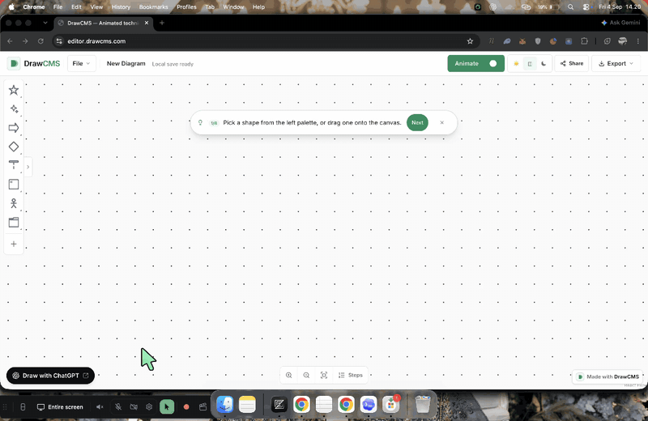
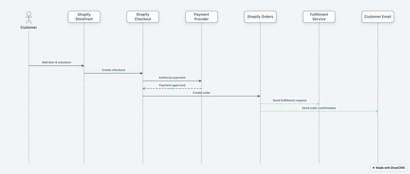

# DrawCMS

An open-source editor for **animated technical diagrams**, built with React Flow and GSAP. Import an existing diagram, explain how it changes over time with motion, and export the result — all local-first, no account required.

This is the **whole product as one app**: the editor engine and the web application live together in a single Next.js project. Clone it, install it, run it — that's the entire setup.

<div align="center">



_Agent drives the editor → the animated result:_



[](https://vercel.com/new/clone?repository-url=https%3A%2F%2Fgithub.com%2Fdrawcms%2Fdrawcms)
[](https://app.netlify.com/start/deploy?repository=https://github.com/drawcms/drawcms)
[](https://render.com/deploy?repo=https://github.com/drawcms/drawcms)
[](https://deploy.workers.cloudflare.com/?url=https://github.com/drawcms/drawcms)

</div>

## Quick Start

```bash
git clone https://github.com/drawcms/drawcms.git drawcms
cd drawcms
npm install
npm run dev
```

Open http://localhost:3002 — the app is the editor itself and redirects there from every route.

## Features

- **100+ diagram elements** — basic shapes plus semantic architecture, sequence, boundary, lifecycle, data-flow, annotation, UML, ER, and BPMN groups
- **Cloud architecture icons** — AWS, GCP, Azure, and infrastructure icons (Docker, Kubernetes, Redis, etc.)
- **Container nodes** — groups, regions, security/trust boundaries, processing stages, sequence frames, swimlanes, and BPMN pools with drag-in/out child support
- **Presentation steps** — select one or more canvas items, right-click, and add a titled, described story step
- **Motion presets** — configure node and connector animation independently in the selected item's Motion tab
- **Live presentation player** — preview from the Steps panel and follow each step's active nodes and connectors with an orange flow packet
- **Focused steps panel** — open Steps beside the fit control to edit scenes and arrange step order without shrinking the canvas vertically
- **Open and import** — `.drawcms` files plus draw.io (`.drawio`) and Excalidraw (`.excalidraw`) imports with a non-blocking import report
- **Local-first** — autosave to browser storage plus explicit save; no account needed
- **Export** — PNG, animated GIF, and the portable `.drawcms` document format
- **Accessible** — keyboard-complete chrome, named controls, and `prefers-reduced-motion` support
- **Extensible** — versioned plugin/host API and persistence adapters for custom storage backends
- **Agent-ready (experimental)** — built-in WebMCP tools let AI agents like ChatGPT create and animate diagrams directly on the live canvas (see [Build diagrams with an AI agent](#build-diagrams-with-an-ai-agent-webmcp))
- **Undo/Redo** — full history with keyboard shortcuts
- **Clipboard** — cut, copy, paste with ID remapping

## Project Structure

One app, no package publishing, no workspace dance:

```
src/
  app/       Next.js application shell — layout, editor route, theme
             toggle, local persistence wiring (the "host" layer)
  editor/    The editor engine — canvas, 100+ element catalog, document
             format, motion, presentation, persistence boundary, WebMCP
             tools, templates, and the test suite
  public/    Static assets (cloud provider icons, GIF worker)
```

`src/app` wires the engine into a full product: autosave with a save-status
pill, theming, and the "Made with DrawCMS" badge. Both layers talk through the
editor's public API (`src/editor/index.ts`) and the persistence boundary
(DM-014), so you can swap storage backends without touching canvas code.

## Build diagrams with an AI agent (WebMCP)

The editor registers a WebMCP toolset with the browser's native
`navigator.modelContext` API. In an agent-capable browser — ChatGPT's agentic
browsing or any WebMCP-compatible agent host — open the editor and the agent
can create animated diagrams directly on the live canvas: no API keys, no
servers, no simulated pointer input. The agent calls the editor's tools like
any other tool, and you watch the diagram build itself.

| Tool                         | What it does                                                                          |
| ---------------------------- | ------------------------------------------------------------------------------------- |
| `drawcms_get_diagram`        | Read the current diagram — nodes, connectors, motion, presentation steps              |
| `drawcms_get_visual_grammar` | Explore the visual dictionary: elements, semantic uses, motion guidance               |
| `drawcms_recommend_visuals`  | Recommend elements, connectors, motion presets, and playback order from a description |
| `drawcms_replace_diagram`    | Build a complete animated diagram in one call                                         |
| `drawcms_edit_diagram`       | Add, update, delete, and connect elements as one undoable batch                       |
| `drawcms_set_motion`         | Retime animation without touching structure                                           |
| `drawcms_set_story`          | Write the presentation step sequence                                                  |
| `drawcms_validate_diagram`   | Check a diagram before committing it                                                  |

### Human + agent collaboration

The agent edits the same canvas you do, so working together is co-editing, not
file handoff. It refines an existing diagram one undoable batch at a time —
reversible with a single Cmd+Z — retimes motion without rebuilding structure,
and rewrites presentation narration while your manual edits and undo history
stay intact. Browsers without WebMCP simply render the ordinary editor.

Try a prompt like: _"Build an animated diagram of a checkout request flowing
through the API gateway, queue, and database, then narrate it in three
presentation steps."_ Agent authoring details live at
[docs.drawcms.com](https://docs.drawcms.com/).

## Tech Stack

- [React 19](https://react.dev)
- [React Flow v12](https://reactflow.dev) — node-based diagram canvas
- [GSAP](https://gsap.com) — animation engine
- [Next.js 16](https://nextjs.org) — app framework (dev/build use webpack deliberately)
- [Tailwind CSS v4](https://tailwindcss.com) — styling
- [Vitest](https://vitest.dev) — test runner

## Development

```bash
npm run dev        # editor on :3002 with hot reload
npm run ci         # lint → format → typecheck → test (360 tests) → build
```

## Documentation

Guides and release notes live at [drawcms.com/docs](https://drawcms.com/docs)
and the blog at [drawcms.com/blog](https://drawcms.com/blog) — quick start,
core concepts, self-hosting, plugin & host API, WebMCP agent authoring,
document format, and browser support.

The docs and blog are part of this repository — GitHub is the CMS. Docs pages
live in `docs/`, blog posts in `blog/`. Two Astro sites render them:
`site/` (docs, served at `drawcms.com/docs`) and `site-blog/` (blog, served at
`drawcms.com/blog`), both as static assets on Cloudflare Workers next to the
app worker, routed by path (`drawcms.com/docs*`, `drawcms.com/blog*`). A
merged pull request touching the sites or content publishes; blog posts
support `draft: true` for merge-before-publish workflows. Run locally with
`npm run docs:dev` (:4321) and `npm run blog:dev` (:4322). Deploys run via
GitHub Actions (set the `CLOUDFLARE_API_TOKEN` and `CLOUDFLARE_ACCOUNT_ID`
repository secrets) or manually with `npm run docs:deploy` and
`npm run blog:deploy`. The main app deploys separately and never rebuilds for
docs-only changes.

## Contributing and Security

Contributions are welcome after accepting the [Contributor License Agreement](CLA.md).
The official repository is [drawcms/drawcms](https://github.com/drawcms/drawcms) —
please open issues and pull requests here.
([dimasna/drawcms-app](https://github.com/dimasna/drawcms-app) is a hackathon-purpose
repo only.) Read [CONTRIBUTING.md](CONTRIBUTING.md) before opening a pull request.
Please report security issues privately using the process in [SECURITY.md](SECURITY.md).

## License

DrawCMS is open-source software licensed under
[GNU AGPL v3.0 only](LICENSE). If you modify it and make that version available
to users over a network, the AGPL generally requires you to offer those users
the corresponding source code under the AGPL.

The AGPL does not prohibit a compliant competing hosted service. The DrawCMS
name and branding are covered separately by [TRADEMARKS.md](TRADEMARKS.md).
Organizations that cannot use the AGPL may request a separate commercial
license; see [COMMERCIAL-LICENSE.md](COMMERCIAL-LICENSE.md). No commercial rights
are granted unless a separate agreement is signed.
